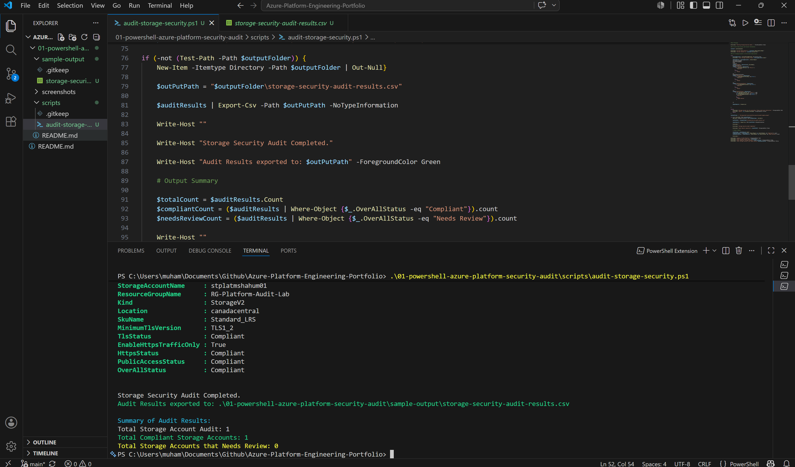
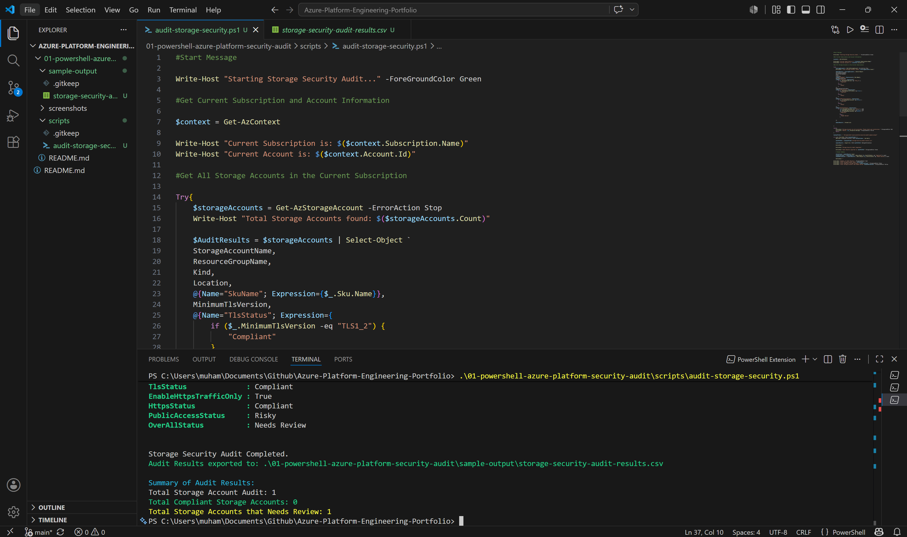
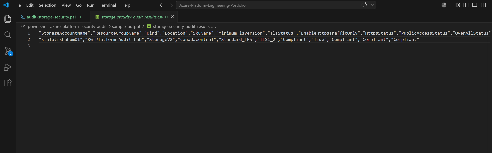
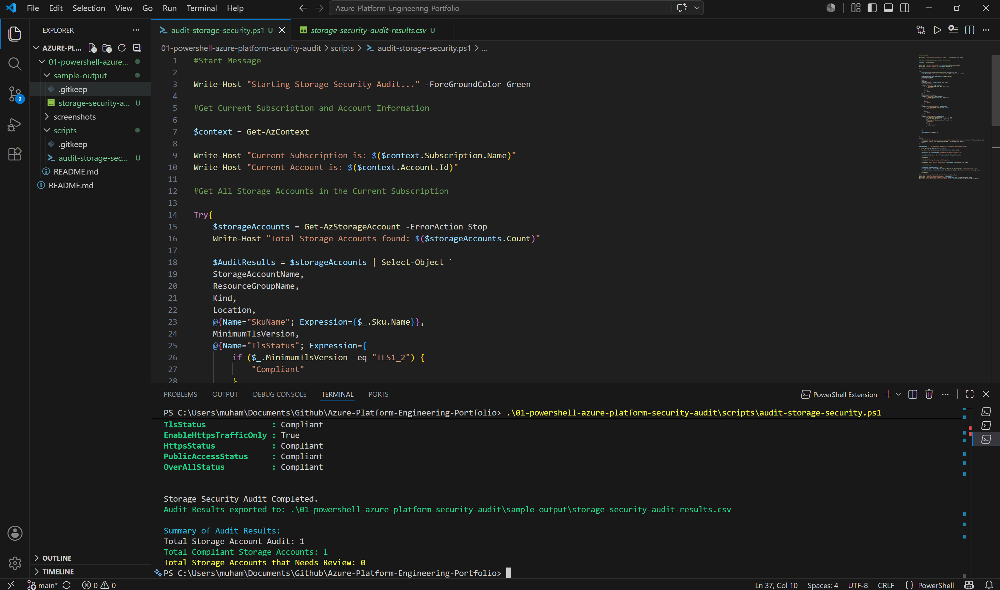

# Lab 01 — PowerShell Azure Platform Security Audit

## Overview

This lab demonstrates how PowerShell can be used to perform a basic security audit of Azure Storage Accounts.

The goal was not only to create an Azure resource, but to build a repeatable audit script that checks important storage security settings, translates those settings into readable compliance status, exports the result to a CSV report, and validates both secure and risky configurations.

This project is part of my Azure Platform Engineering portfolio, focused on practical cloud automation, secure operations, troubleshooting, and production style documentation.

---

## Business Problem

In a real Azure environment, teams may have many Storage Accounts spread across different resource groups and subscriptions. Manually checking each one in the Azure Portal is slow, inconsistent, and easy to miss.

Security and platform teams need a repeatable way to answer questions such as:

* Are Storage Accounts enforcing modern TLS?
* Is HTTPS only traffic enabled?
* Is public blob access disabled?
* Which resources are compliant?
* Which resources need review?
* Can the result be exported and shared as evidence?

This lab solves that problem by using PowerShell to audit Storage Account security settings and produce a clear report.

---

## Real World Scenario

A cloud platform or security engineer is asked to review Storage Account security posture across an Azure environment.

Instead of checking settings manually in the portal, the engineer writes a script that:

1. Connects to the active Azure context.
2. Finds Azure Storage Accounts.
3. Checks key security settings.
4. Converts raw configuration values into human-readable status.
5. Exports the results to a CSV file.
6. Provides a summary count of compliant and risky resources.

This is the type of automation that supports cloud governance, security reviews, operational reporting, and audit readiness.

---

## Skills Demonstrated

This lab demonstrates practical skills in:

* Azure PowerShell scripting
* Azure resource discovery
* Storage Account security review
* PowerShell calculated properties
* Conditional logic
* Compliance status reporting
* CSV report generation
* Terminal based cloud operations
* Basic troubleshooting
* Security validation
* GitHub portfolio documentation
* Production style thinking

---

## Project Objectives

The main objectives of this lab were to:

* Use PowerShell to query Azure Storage Accounts.
* Read important security configuration values.
* Check whether each setting meets a basic security baseline.
* Add custom status fields such as `TlsStatus`, `HttpsStatus`, `PublicAccessStatus`, and `OverallStatus`.
* Export audit results to a CSV file.
* Test the script against both compliant and risky configurations.
* Document the validation process clearly for GitHub portfolio evidence.

---

## Technologies Used

* Microsoft Azure
* Azure PowerShell module
* PowerShell 7
* Visual Studio Code
* Git and GitHub
* Azure Storage Account
* CSV reporting
* Windows terminal / VS Code integrated terminal

---

## Security Baseline Used

The script checks each Storage Account against the following baseline:

| Setting             | Expected Secure Value | Reason                                                            |
| ------------------- | --------------------: | ----------------------------------------------------------------- |
| Minimum TLS Version |              `TLS1_2` | Helps enforce modern encryption standards for client connections. |
| HTTPS Traffic Only  |                `True` | Blocks insecure HTTP traffic and requires encrypted access.       |
| Blob Public Access  |               `False` | Reduces the risk of accidental public exposure of blob data.      |

If all three checks pass, the Storage Account is marked as:

```text
Compliant
```

If any one of the checks fails, the Storage Account is marked as:

```text
Needs Review
```

---

## What Was Implemented

### 1. Azure Context Validation

The script starts by checking the active Azure context. This helps confirm which account and subscription are currently being used before running any audit commands.

This is important because cloud engineers must avoid running automation against the wrong subscription or tenant.

---

### 2. Storage Account Discovery

The script uses Azure PowerShell to retrieve Storage Accounts from the current Azure subscription.

```powershell
Get-AzStorageAccount
```

This provides the base resource data used for the audit.

---

### 3. Security Setting Checks

The script checks the following settings:

* `MinimumTlsVersion`
* `EnableHttpsTrafficOnly`
* `AllowBlobPublicAccess`
* `Sku.Name`
* Resource group
* Location
* Storage account kind

Some values, such as SKU name, are stored as nested properties. The script uses calculated properties to extract and display them clearly.

Example:

```powershell
@{Name="SkuName"; Expression={$_.Sku.Name}}
```

---

### 4. Compliance Status Logic

The script adds readable status columns instead of only showing raw Azure values.

For example:

```powershell
@{Name="HttpsStatus"; Expression={
    if ($_.EnableHttpsTrafficOnly -eq $true) {
        "Compliant"
    }
    else {
        "Risky"
    }
}}
```

This makes the output easier to understand for engineers, managers, and auditors.

---

### 5. Overall Status

The script combines all security checks into one final status field.

A Storage Account is marked as `Compliant` only when:

```text
MinimumTlsVersion = TLS1_2
EnableHttpsTrafficOnly = True
AllowBlobPublicAccess = False
```

Otherwise, it is marked as:

```text
Needs Review
```

---

### 6. CSV Export

The script exports the final audit result to a CSV file:

```text
sample-output/storage-security-audit-results.csv
```

This makes the audit result reusable and shareable outside the terminal.

---

### 7. Audit Summary

The script also provides a summary count:

```text
Total Storage Accounts
Compliant
Needs Review
```

This gives a quick high level view of the audit result.

---

## Validation and Testing

The lab was validated in three stages.

### Test 1 — Compliant Configuration

The Storage Account was first audited with secure settings enabled.

Expected result:

```text
OverallStatus : Compliant
Compliant     : 1
Needs Review  : 0
```

This confirmed that the script correctly identifies a secure Storage Account.

---

### Test 2 — Risky Configuration Detection

To test whether the script could detect a misconfiguration, blob public access was temporarily enabled at the Storage Account level.

The setting was changed using:

```powershell
Set-AzStorageAccount `
    -ResourceGroupName "RG-Platform-Audit-Lab" `
    -Name "stplatmshahum01" `
    -AllowBlobPublicAccess $true
```

After running the audit again, the script correctly detected the risky setting.

Expected result:

```text
AllowBlobPublicAccess : True
PublicAccessStatus    : Risky
OverallStatus         : Needs Review
Needs Review          : 1
```

This was an important validation step because it proved the script can detect both secure and insecure configurations.

---

### Test 3 — Secure Setting Restored

After testing the risky configuration, blob public access was disabled again:

```powershell
Set-AzStorageAccount `
    -ResourceGroupName "RG-Platform-Audit-Lab" `
    -Name "stplatmshahum01" `
    -AllowBlobPublicAccess $false
```

The audit was then run again to confirm the Storage Account returned to a compliant state.

Expected result:

```text
OverallStatus : Compliant
Compliant     : 1
Needs Review  : 0
```

---

## Troubleshooting Notes

During the lab, Azure PowerShell authentication required tenant specific login.

The issue was resolved by connecting with a specific tenant ID using device authentication.

This highlighted an important operational lesson:

> Always confirm the correct Azure tenant and subscription context before running automation.

In real environments, running commands against the wrong tenant or subscription can create inaccurate reports or operational risk.

---

## Production Recommendation vs Lab Setting

### Lab Setting

This lab was performed against one test Storage Account in a controlled Azure environment.

The script was run manually from VS Code and exported a CSV report locally into the repository.

### Production Recommendation

In a production environment, this type of audit could be improved by:

* Running across multiple subscriptions.
* Using a managed identity instead of interactive login.
* Scheduling the script through Azure Automation, GitHub Actions, or another pipeline.
* Exporting results to a central storage location.
* Sending non compliant findings to Log Analytics, Sentinel, or a ticketing system.
* Adding more checks such as network rules, private endpoint usage, diagnostic settings, soft delete, versioning, and encryption configuration.
* Applying role based access control so the script only has the permissions required to read resource configuration.

This lab is intentionally small, but the pattern is realistic: automate the check, generate evidence, detect risk, and document the result.

---

## Security and Operational Impact

This lab demonstrates how automation can support:

* Cloud security posture reviews
* Storage Account hardening
* Audit evidence collection
* Operational reporting
* Misconfiguration detection
* Repeatable governance checks
* Reduced manual portal checking
* Better visibility for platform and security teams

The key value is not just the Storage Account itself. The main value is the repeatable audit approach.

---

## Files Included

```text
01-powershell-azure-platform-security-audit/
├── README.md
├── scripts/
│   └── audit-storage-security.ps1
├── sample-output/
│   └── storage-security-audit-results.csv
└── screenshots/
    ├── 01-script-code-in-vscode.png
    ├── 02-compliant-audit-result.png
    ├── 03-risky-storage-setting-detected.png
    ├── 04-csv-report-generated.png
    └── 05-secure-setting-restored.png
```
---

## Implementation Evidence

### 1. PowerShell Audit Script in VS Code

The script was written in VS Code and includes Azure resource discovery, calculated properties, security status checks, overall compliance logic, CSV export, and summary reporting.


---

### 2. Compliant Audit Result

The script successfully identified the Storage Account as compliant when secure baseline settings were enabled.



---

### 3. Risky Storage Setting Detected

Blob public access was temporarily enabled to test the detection logic. The script correctly marked the resource as risky and changed the overall status to `Needs Review`.



---

### 4. CSV Audit Report Generated

The script exported the audit result to a CSV file inside the `sample-output` folder.



---

### 5. Secure Setting Restored

After testing the risky configuration, the setting was restored to secure and the script confirmed the Storage Account returned to a compliant state.



---

## Cleanup and Cost Control

To avoid unnecessary Azure costs, the lab resource group can be removed after evidence has been captured:

```powershell
Remove-AzResourceGroup -Name "RG-Platform-Audit-Lab" -Force
```

This removes the test resources created for the lab.

In real environments, cleanup commands should be reviewed carefully before execution, especially when working in shared or production subscriptions.

---

## Final Outcome

The lab successfully produced a working Azure Storage Account audit script that can:

* Discover Storage Accounts.
* Check key security settings.
* Identify compliant and risky configurations.
* Export audit evidence to CSV.
* Provide summary reporting.
* Demonstrate a repeatable cloud security and platform engineering workflow.

This lab forms the first step in a larger Azure Platform Engineering portfolio focused on automation, Infrastructure as Code, monitoring, governance, troubleshooting, and secure cloud operations.

